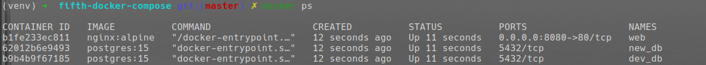
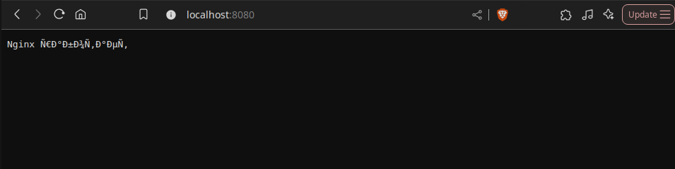
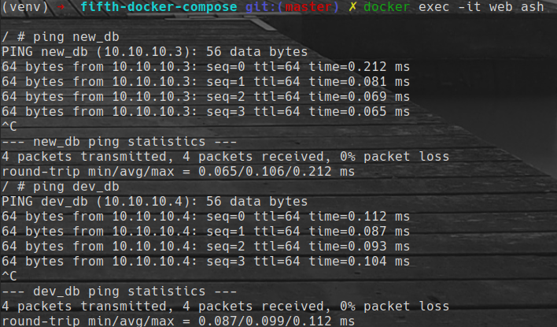

# Docker Compose Example: Nginx + PostgreSQL

Проект запускает три контейнера:
- `web` — Nginx, отдаёт HTTP на порт `8080`
- `new_db` — PostgreSQL (1-я БД)
- `dev_db` — PostgreSQL (2-я БД)

Контейнеры находятся в одной кастомной сети `10.10.10.0/28`.

---

## Структура проекта

```
.
├── docker-compose.yml
├── nginx/
│   └── default.conf
└── README.md
```

---

## Команды для запуска

### 1. Запуск контейнеров

```bash
docker-compose up -d
```

### 2. Проверка поднятых контейнеров

```bash
docker ps
```



### 3. Проверка web


```
http://localhost:8080
```



### 4. Проверка что db доступны из web

Заходим в контейнер

```bash
docker exec -it web ash
```
Пингуем БДшки

```bash
ping new_db
ping dev_db
```


 
