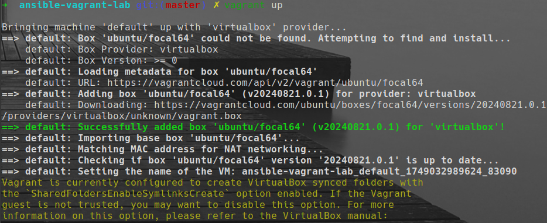
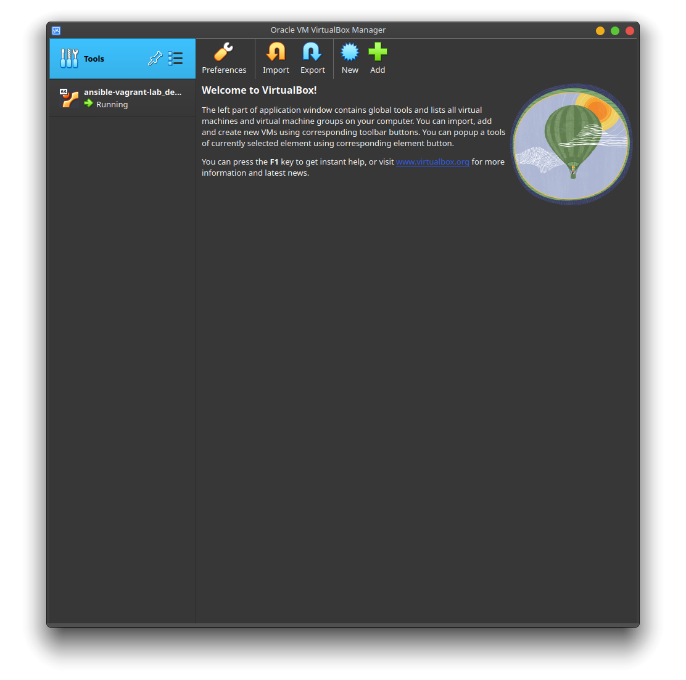
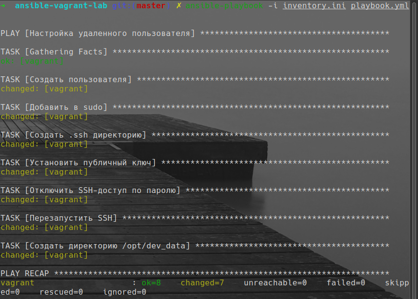

# 🧰 Ansible Playbook: devuser Setup with Vagrant and VirtualBox

Этот проект демонстрирует, как с помощью **Ansible** настроить пользователя `devuser` на виртуальной машине, созданной через **Vagrant** и **VirtualBox**.
---

## 📦 Что делает playbook?

- Создает пользователя `devuser`
- Назначает его в группу `sudo`
- Разрешает использовать `sudo` **без пароля**
- Настраивает **авторизацию по SSH-ключу** для `devuser`
- Отключает SSH-доступ по паролю для всех
- Создает директорию `/opt/dev_data` с правами `660`, владельцем — `devuser`

---

### 1. Поднимаем виртуалку через Vagrant

```bash
vagrant up
```





### 2. Запусти playbook

```bash
ansible-playbook -i inventory.ini playbook.yml
```




---

## 🖼 Скриншоты (добавь сюда)

- `vagrant up`
- `ansible-playbook` запуск
- `ls -ld /opt/dev_data`
- `sudo whoami` от имени `devuser`

---

## 🗝 SSH доступ к виртуалке

```bash
ssh devuser@127.0.0.1 -p 2222 -i .vagrant/machines/default/virtualbox/private_key
```


---

## 📁 Структура

```
 .
├──  files
│  └── 󰷖 id_rsa_ansible.pub
├──  inventory.ini
├──  pics
│  ├──  ansible.png
│  ├──  ansible2.png
│  ├──  ansible3.png
│  ├──  directory.png
│  ├──  vagrant-up.png
│  └──  vm.png
├──  playbook.yml
├──  README.md
└── ⍱ Vagrantfile
```

---
