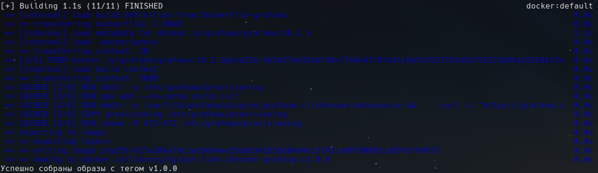
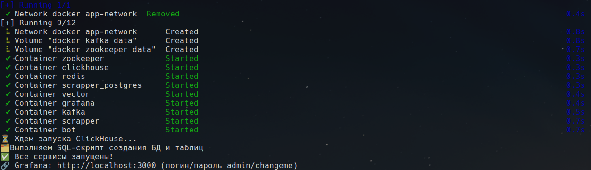
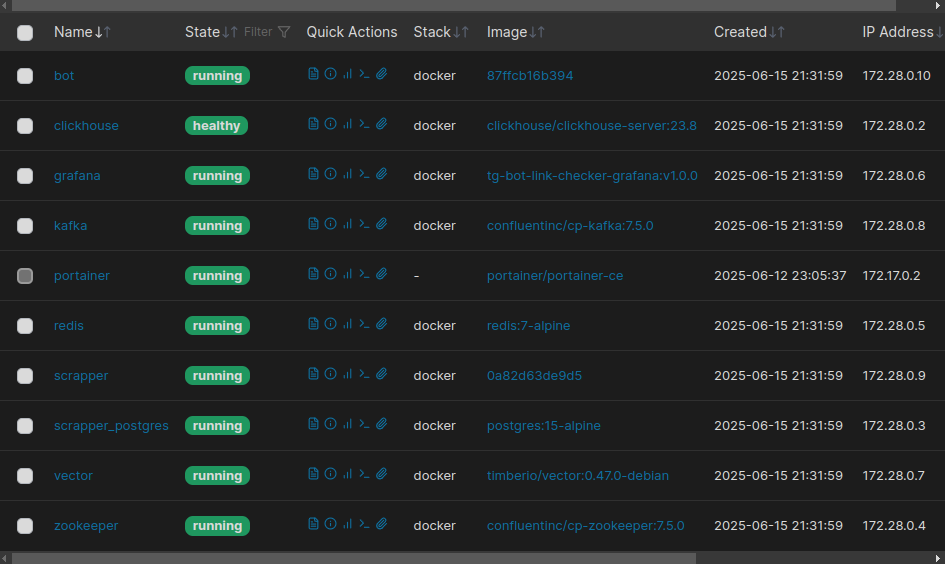
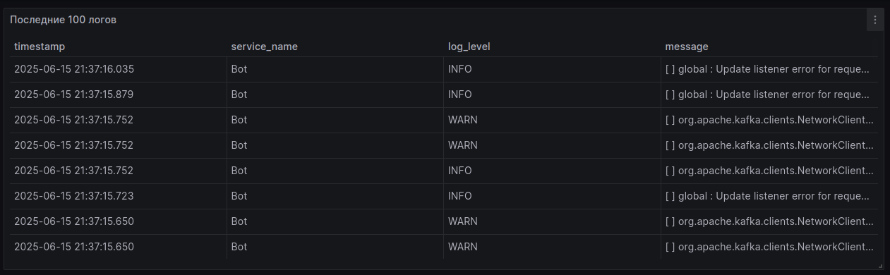

# Финальная Д/З

Реализован build и deploy для сервиса в виде тг-бота в Docker.

## Описание архитектуры

```
├──  bot
│  ├──  pom.xml
│  ├──  src
│  
├──  docker
│  ├──  clickhouse-init
│  │  └──  create_logs_table.sql
│  ├──  docker-compose.yml
│  ├──  Dockerfile-bot
│  ├──  Dockerfile-scrapper
│  ├──  grafana
│  │  ├──  Dockerfile-grafana
│  │  └──  provisioning
│  │     ├──  dashboards
│  │     │  ├──  dashboards.yml
│  │     │  └──  sample-logs-dashboard.json
│  │     └──  datasources
│  │        └──  clickhouse.yml
│  └──  vector
│     └── vector.toml
│
├──  HELP.md
├──  lombok.config
├──  mvnw
├──  mvnw.cmd
├── 󰗀 pmd.xml
├──  pom.xml
├──  README.md
│
├──  scrapper
│  ├──  pom.xml
│  ├──  src
│  
├──  scripts
│  ├──  build.sh
│  └──  deploy.sh
```

Есть два основных микросервиса, общающихся через kafka/http - ```bot``` и ```scrapper```.
Помимо микросервисов на java, мы так же поднимаем kafka+zookeeper, redis, postgresql. Для логгирования так же бонусом добавила clickhouse, vector и grafana.

## Build
Для сборки используется скрипт build.sh - запускать следует из root директории.
```
./scripts/build.sh -t v1.0.0
```


Собираются образы микросервисов, вместе со всеми зависимостями, а также собирается образ grafana (с предустановленным плагином для работы с clickhouse, с датасурсом в виде кликхауса и дашбордом)

## Deploy
Для сборки используется скрипт deploy.sh - запускать следует из root директории.
```
./scripts/deploy.sh -t v1.0.0
```


Работает по такой логике: сперва проверяются образы которые должны быть собраны (с указанным тегом), далее загружаем образы необходимые для остальных сервисов. Проверяется наличие конфигурации Vector. Далее поднимаем весь стек, чистим контейнеры, ждем запуск clickhouse, и накатываем туда скрипт для создания БД и таблицы с логами.



## Логгирование
Логирование реализовано по такой схеме:

```
stdout/stderr (docker)
      │
      │
vector (парсинг/отправка в ch)
      │
      │
clickhouse (хранение)
      │
      │
    grafana 
```

## Активный дашборд с логами напрямую из clickhouse:


