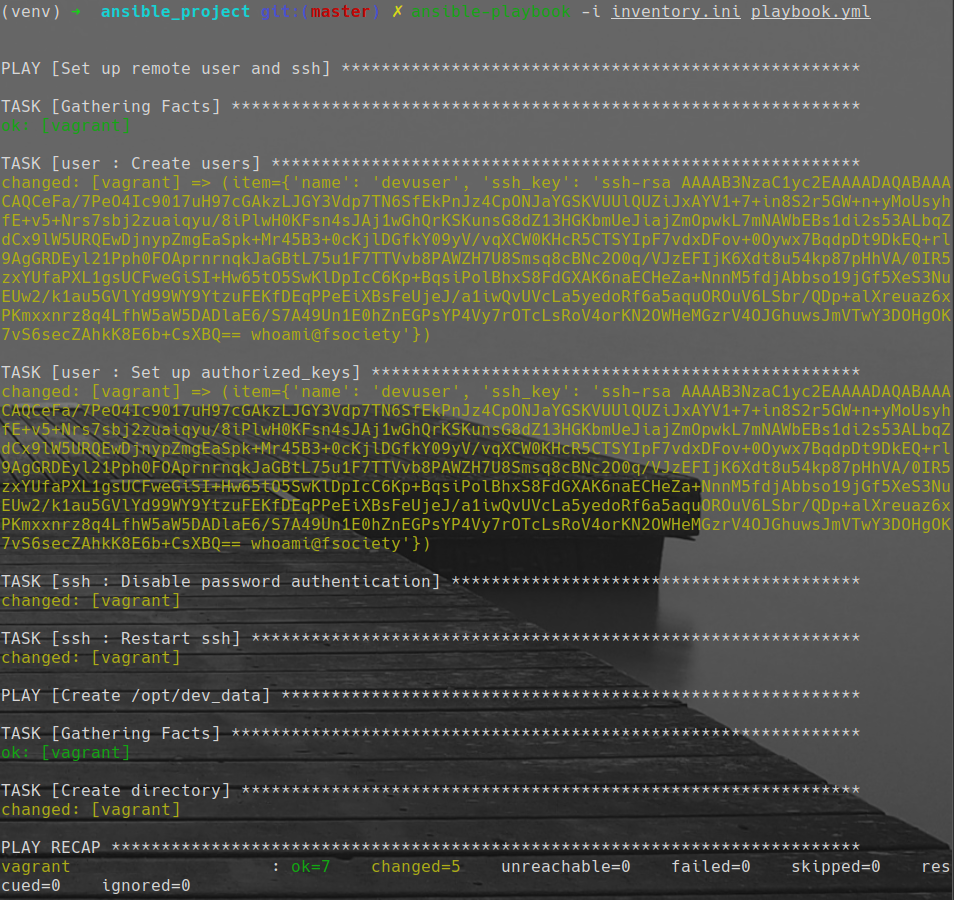
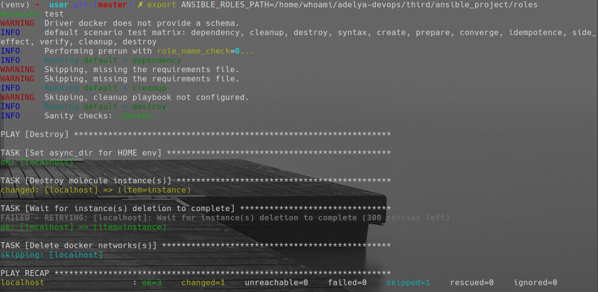
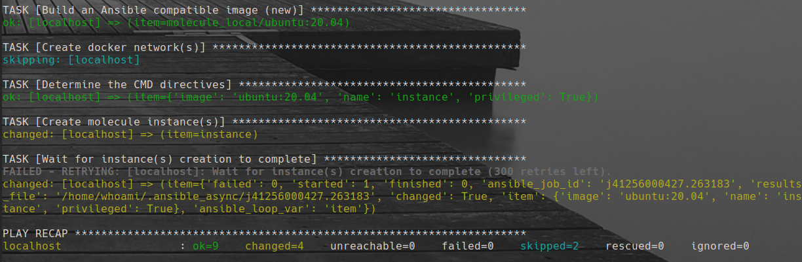
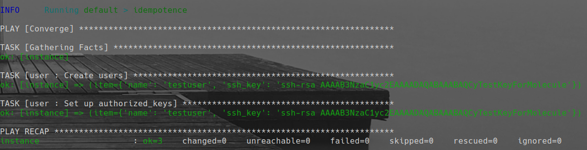
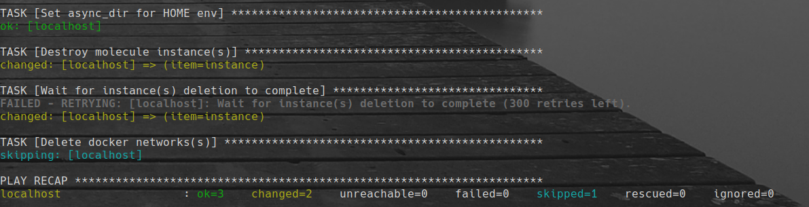

 
# New Ansible project structure + molecule testing

---

## Структура проекта
```
 .
├──  ansible.png
├──  ansible_project
│  ├──  files
│  │  └── 󰷖 id_rsa_ansible.pub
│  ├──  group_vars
│  │  └──  all.yml
│  ├──  inventory.ini
│  ├──  playbook.yml
│  ├──  requirements.txt
│  ├──  roles
│  │  ├── 󰢬 ssh
│  │  │  ├──  defaults
│  │  │  │  └──  main.yml
│  │  │  ├──  files
│  │  │  ├──  handlers
│  │  │  │  └──  main.yml
│  │  │  ├──  meta
│  │  │  │  └──  main.yml
│  │  │  ├──  molecule
│  │  │  │  └──  default
│  │  │  │     ├──  converge.yml
│  │  │  │     └──  molecule.yml
│  │  │  ├──  README.md
│  │  │  ├──  tasks
│  │  │  │  └──  main.yml
│  │  │  ├──  templates
│  │  │  ├──  tests
│  │  │  │  ├──  inventory
│  │  │  │  └──  test.yml
│  │  │  └──  vars
│  │  │     └──  main.yml
│  │  └──  user
│  │     ├──  defaults
│  │     │  └──  main.yml
│  │     ├──  files
│  │     ├──  get-docker.sh
│  │     ├──  handlers
│  │     │  └──  main.yml
│  │     ├──  meta
│  │     │  └──  main.yml
│  │     ├──  molecule
│  │     │  └──  default
│  │     │     ├──  converge.yml
│  │     │     └──  molecule.yml
│  │     ├──  README.md
│  │     ├──  tasks
│  │     │  └──  main.yml
│  │     ├──  templates
│  │     ├──  tests
│  │     │  ├──  inventory
│  │     │  └──  test.yml
│  │     └──  vars
│  │        └──  main.yml
│  ├── ⍱ Vagrantfile
```

---

### 1. Запустить виртуальную машину:

bash
```
vagrant up
```

---

### 2. Запустить Ansible:

bash
ansible-playbook -i inventory.ini playbook.yml




---

### 3. Тесты Molecule 

Из корня ansible_project/roles/user ролей запускаем

bash
```
molecule test
```
---

Вывод теста:









